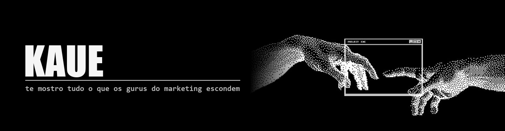
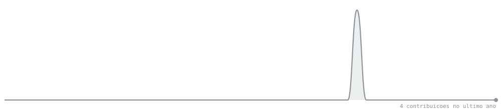

  

  
  &nbsp;
  
  &nbsp;
  

 

  <h2>Sobre mim</h2>

<table>
  <tr>
    <td width="65%" valign="top">
      <h3>Oi, me chamo Kauê 👋</h3>
      

        Minha especialidade está em unir programação, automação e inteligência
        artificial para criar soluções inteligentes.
      

      

        Já desenvolvi projetos envolvendo dezenas de agentes trabalhando
        simultaneamente, automações para produção e distribuição de conteúdo em
        múltiplas plataformas e sistemas capazes de operar centenas de tarefas
        de forma praticamente autônoma.
      

      

        Tenho uma regra simples: é muito difícil eu fazer a mesma coisa três
        vezes. Se precisei repetir duas, provavelmente na terceira eu já
        automatizei o processo.
      

    </td>
    <td width="35%" valign="middle" align="center">
      
    </td>
  </tr>
</table>

 

  <h2>Projetos</h2>
  <i>construídos pra não ter que fazer na mão</i>

<table>
  <tr>
    <td width="65%" valign="top">
       
      <b>◆ EMPRESA AUTOMATIZADA — 54 AGENTES</b> 
      Cinquenta e quatro agentes trabalhando ao mesmo tempo, em árvore. Eles
      editam vídeo, publicam no Instagram e respondem os comentários. Um painel
      próprio mostra quem está trabalhando e quem está parado, em tempo real.
        
      <b>◆ 5 CANAIS · 15 VÍDEOS POR DIA</b> 
      Produção e distribuição rodando sozinhas em YouTube, TikTok e outras
      plataformas. Corte, legenda, renderização, agendamento e publicação — sem
      ninguém apertar botão.
        
      <b>◆ EDIÇÃO DE VÍDEO EM MASSA</b> 
      Mais de cem vídeos editados num único dia. Detecção do corte por pico
      de áudio, legenda gerada por transcrição e montagem final em fila — tudo
      local, sem serviço pago no meio.
        
      <b>◆ DUAS IAs CONSTRUINDO O MESMO SISTEMA</b> 
      Duas instâncias de IA, em máquinas e donos diferentes, desenvolvendo o
      mesmo sistema em turnos: uma escreve, a outra revisa e aponta o erro, e só
      então troca a vez. Elas conversam por um canal próprio e nunca executam ao
      mesmo tempo. Cada uma já achou defeito real no trabalho da outra.
       
    </td>
    <td width="35%" valign="middle" align="center">
      
    </td>
  </tr>
</table>

 

  <h2>Onde me achar</h2>
   
  
  &nbsp;
  
  &nbsp;
  
  &nbsp;
  
   

<!--
  Aqui havia duas frases "espirituosas" que eu escrevi. Eram TRADUCAO das do
  perfil que serviu de modelo:
    "Code is never finished. It only becomes slightly less terrible over time."
    "Every commit is a small, desperate apology to my future self."
  Copiar a piada de outra pessoa e assinar como sua e pior do que nao ter piada
  nenhuma. Se entrar texto aqui, tem que ser dele.
-->

 

  <h2>Contribuições</h2>

  

<!--
  O gráfico é gerado por `gerar-grafico.py` e mora NESTE repositório.
  O modelo original usava github-readme-activity-graph.vercel.app, que hoje
  responde HTTP 402 — virou pago. Testei três espelhos, todos fora do ar.
  Imagem de serviço gratuito de terceiro some sem avisar e vira  quebrado
  no meio do perfil. Esta some só se o GitHub sair do ar.
-->
